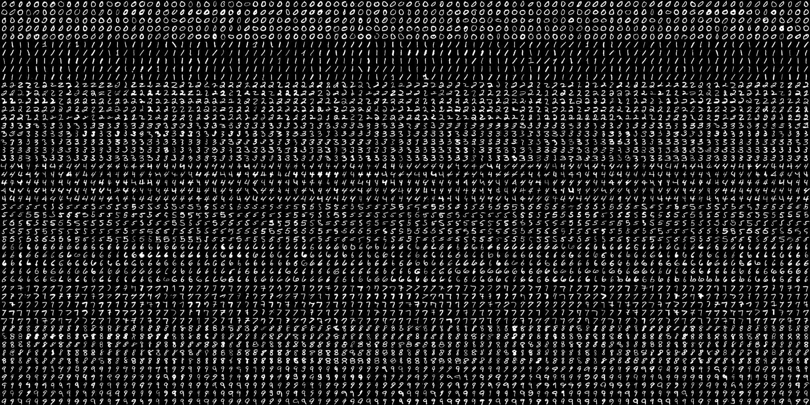
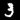
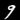
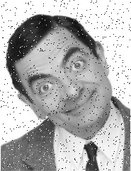
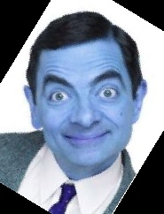

# image_processing_6

## SNOW_GIF :
J'ai créé un gif en utilisant ces bibliothèques (imageio ,Random et cv2)

et voilà mon gif...   8-)

---
## Seprate_Numbers :
Il s'agit de séparer les nombres de chaque partie et placer les mêmes nombres dans une dossier spécialisé. donc finalement il faut avoir 500 photos dans chaque dossier de zéro à neuf!

et la sortie...

    ... 

---
 
## Mr_beann :

### 1. ajouter des noises :

### 2. réduire des noises :

### 3. tourner la photo :

